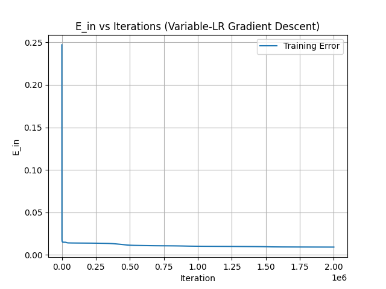
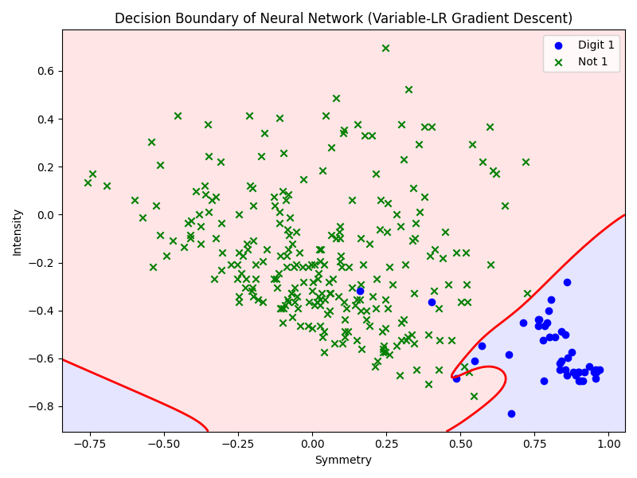
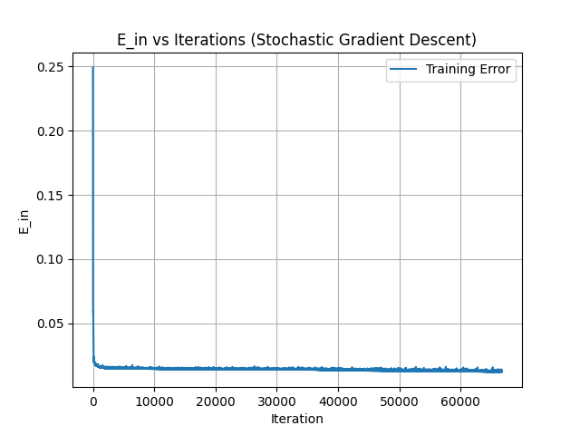
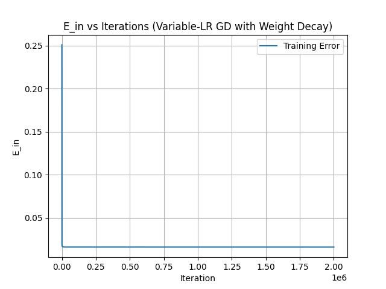
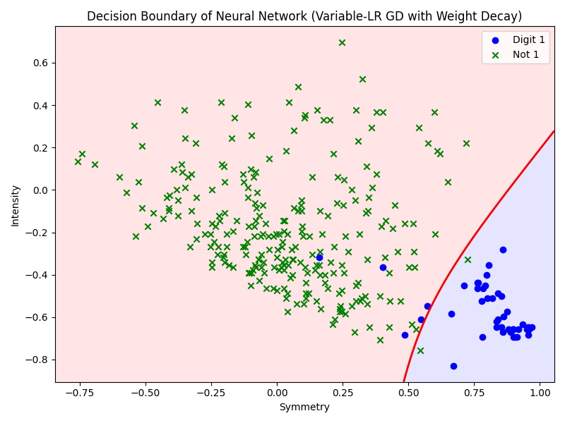
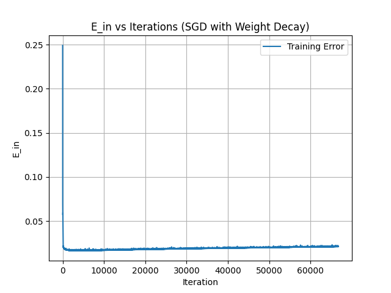
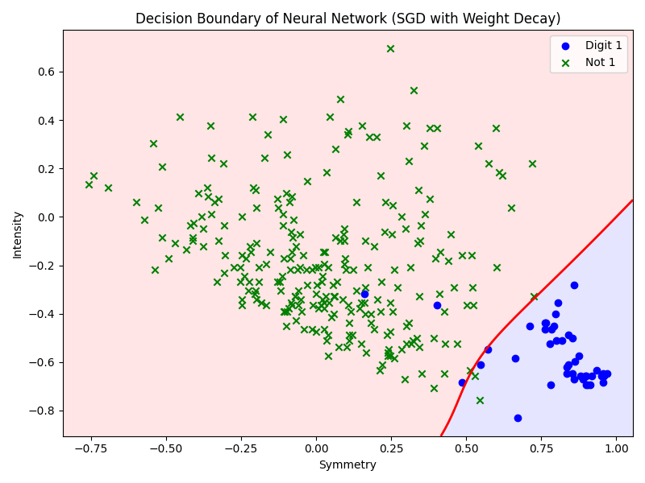
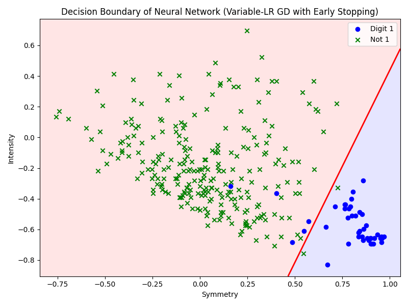
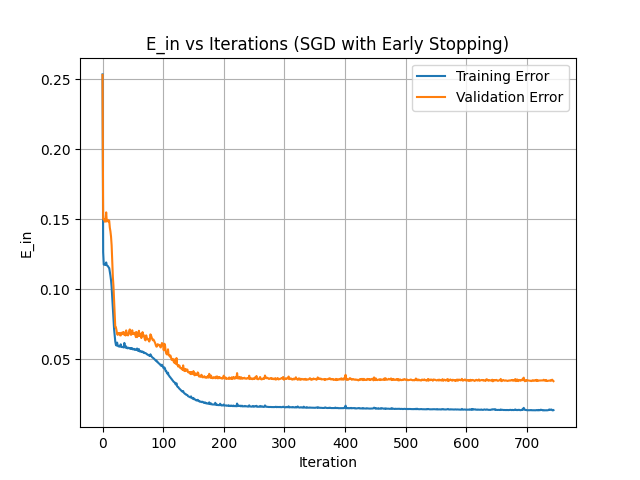
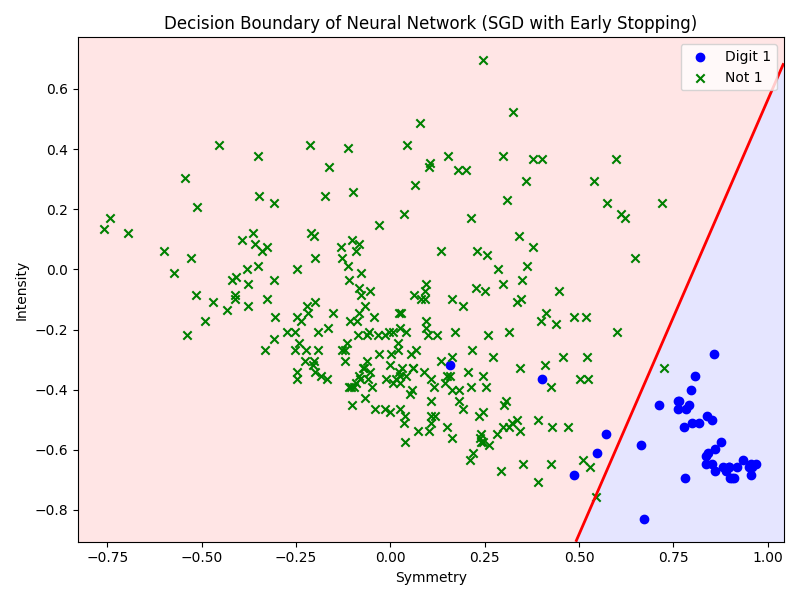

# Mid-Level Neural Network for Digits Classification
A mid-level neural network implementation from scratch on the MNIST Zip-Digits dataset. Includes forward and backward propagation, adaptive activation function selection, training/validation split and testing, and various gradient descent techniques (VLR-GD, SGD, VLR-GD-ES, SGD-ES, VLR-GD-WD, SGD-WD).

The primary purpose of this project was to develop a strong foundation in the theory and implementation of neural networks and to compare the performance of different gradient descent algorithms on digit classification. Writing the codebase in C++ got me implement all of the math and algorithms manually from scratch. I utilized a modular design with a single layer class, a neural network driver class, and flexible user choice for between-layer activation. The results were plotted using Matplotlib and the Python frontend was called using std::system. All matrix operations were handled using the Eigen library in C++, which provided a comprehensive set of hyper-optimized functionalities for linear algebra purposes.

## Getting Started
### Prerequisites
- **C++17 or later** (GCC, Clang, or MSVC)
- **CMake** (optional)
- **Eigen3.4+**
- **Python3.11 + Matplotlib** (for plotting loss curves + decision boundaries)

1. **Clone the Repository**:
  ```
  git clone https://github.com/jameswu05/nn-zip-classifier.git
  cd nn-zip-classifier
  ```
2. **Ensure the correct Eigen path**
3. **Compile and Run**:
  ```
  # navigate to source code folder
  cd src

  # file_name = main (to run two-layer gradient descent)
  # file_name = train_digits (to run VLR-GD)
  # file_name = train_digits_sgd (to run SGD)
  # file_name = train_digits_weight_decay (to run VLR-GD-WD)
  # file_name = train_digits_sgd_weight_decay (to run SGD-WD)
  # file_name = train_digits_early_stopping (to run VLR-GD-ES)
  # file_name = train_digits_sgd_early_stopping (to run SGD-ES)
  g++ -std=c++17 [file_name].cpp -I /usr/include/eigen3 -O2 -o [exec_name]

  # executables are stored in the exec folder
  ./[exec_name]
  ```

### Directory Structure

```
project/
├── data/                           # CSV logs & grid predictions
│   ├── errors_sgd.csv
│   ├── errors_sgd_es.csv
│   ├── errors_sgd_wd.csv
│   ├── errors_var.csv
│   ├── errors_var_es.csv
│   ├── errors_var_wd.csv
│   ├── grid_predictions_SGD.csv
│   ├── grid_predictions_SGDES.csv
│   ├── grid_predictions_SGDWD.csv
│   ├── grid_predictions_VLRGD.csv
│   ├── grid_predictions_VLRGDES.csv
│   ├── grid_predictions_VLRGDWD.csv
│   ├── val_errors_sgd_es.csv
│   ├── val_errors_var_es.csv
│   └── (14 files)
│
├── exec/                           # Executables for training
│   ├── train_digits
│   ├── train_digits_early_stopping
│   ├── train_digits_sgd
│   ├── train_digits_sgd_early_stopping
│   ├── train_digits_sgd_weight_decay
│   └── train_digits_weight_decay
│
├── plots/                          # Visualizations
│   ├── decision_boundary_sgd.png
│   ├── decision_boundary_sgd_es.png
│   ├── decision_boundary_sgd_wd.png
│   ├── decision_boundary_var.png
│   ├── decision_boundary_var_es.png
│   ├── decision_boundary_var_wd.png
│   ├── errors_sgd.png
│   ├── errors_sgd_es.png
│   ├── errors_sgd_wd.png
│   ├── errors_var_lr_gd.png
│   ├── errors_var_lr_gd_es.png
│   ├── errors_var_lr_gd_wd.png
│   └── (12 files)
│
└── src/                            # Core source code
    ├── helper_functions.cpp
    ├── layers.h
    ├── main.cpp
    ├── nn.h
    ├── plot_decision_boundary.py
    ├── plot_errors.py
    ├── train_digits.cpp
    ├── train_digits_early_stopping.cpp
    ├── train_digits_sgd.cpp
    ├── train_digits_sgd_early_stopping.cpp
    ├── train_digits_sgd_weight_decay.cpp
    ├── train_digits_weight_decay.cpp
    ├── ZipDigitsRandom.test
    └── ZipDigitsRandom.train
```

## Dataset
The US Post Office Zip Code data is used for all digits classification, 0-9. The original dataset consists of 7291 training images and 2007 test images, each 16x16 grayscale, and was developed by Yann LeCun at AT&T Research Labs. This project deals with classifying all images with label = 1 vs. all images with label != 1. The dataset has been pre-processed, with each entry consisting of two extracted features - intensity and symmetry. Following pre-processing, I utilized 300 images for training and 8998 for testing.

We define symmetry and intensity features below.

**Symmetry:**

$$
\text{Symmetry} = -\frac{1}{d} \sum_{i = 1}^d \big(|x_i - F(x)_i| + |x_i - G(x)_i|\big)
$$

where \(d = 256\) pixels, \(F(x)\) is the vertical flip of pixel \(x\), and \(G(x)\) is the horizontal flip of pixel \(x\).

**Intensity:**

$$
\text{Intensity} = \frac{1}{d} \sum_{i = 1}^d \frac{B(x_i)}{d}
$$

where \(d = 256\) and 

$$
B(x) = 
\begin{cases}
1, & \text{if $x$ is black} \\
-1, & \text{if $x$ is not black}
\end{cases}
$$

The data is stored in src, and each row of ZipDigitsRandom.test and ZipDigitsRandom.train is of the format (label, symmetry, intensity).

## Features
- **Hidden Layer Activations**:
  - tanh (FP only) and tanh derivative (BP only)
  - identity (FP only) and identity derivative (BP only)
  - sign (FP only) and sign derivative (BP only)
- **Last Layer Activations**:
  - tanh (FP only) and tanh derivative (BP only)
  - identity (FP only) and identity derivative (BP only)
  - sign (FP only) and sign derivative (BP only)
- **Gradient Descent Algorithms**:
  - Variable Learning Rate Gradient Descent (VLR-GD)
  - Stochastic Gradient Descent (SGD)
  - Variable Learning Rate Gradient Descent with Weight Decay Regularization (VLR-GD-WD)
  - Stochastic Gradient Descent with Weight Decay Regularization (SGD-WD)
  - Variable Learning Rate Gradient Descent with Early Stopping Regularization
    - Utilized a training/validation split of 250 training, 50 validation
  - Stochastic Gradient Descent with Early Stopping Regularization
    - Similarly utilized a training/validation split of 250 training, 50 validation
### Modularity
The .h backend allows for adaptive selection of hidden-layer and last-layer activations and de-activations, number of iterations, and choice of regularization. Hyperparameters are not optimized so that is left to the user's discretion. 

## Architecture and Hyperparameters
**Simple Two-Layer Gradient Descent**:
  - 2 input nodes (symmetry and intensity)
  - 1 output node (classification)
  - tanh activation function on hidden layer
  - identity transformation on output layer
  - All weights initially set to 0.15

For all below methods, I utilize 2 input nodes (symmetry and intensity), 1 output node (classification), 1 hidden layer with 10 nodes, tanh activation function on hidden layer, and linear/sign transformation on output layer. Weights are randomly initialized then learned through backpropagation.

- **VLR-GD**:
  - No regularization or validation
- **SGD**:
  - No regularization or validation
- **VLR-GD-WD**:
  - Regularization parameter lambda set to 0.01 / N with N = size of training data
  - Stopping criteria set to 1e-6
- **SGD-WD**:
  - Regularization parameter lambda set to 0.01 / N
  - Initial epsilon-decay value set to 0.01
- **VLR-GD-ES**:
  - Training set of size 250, validation set of size 50
  - Initial epsilon-decay value set to 0.01
  - alpha = 1.05 (parameter to speed up gradient descent if weights are positively updated)
  - beta = 0.7 (parameter to slow down gradient descent if weights are negatively downgraded or no change)
  - Stopping criteria set to 1e-6
  - Early Stopping max-number of iterations after hitting stopping criteria (patience) set to 100
- **SGD-ES**:
  - Training set of size 250, validation set of size 50
  - Initial epsilon-decay value set to 0.01
  - Stopping criteria set to 1e-6
  - Early Stopping max-number of iterations after hitting stopping criteria (patience) set to 100

## Methodology and Results
  - **VLR-GD**:
    - 2 million iterations
    - Training Results:
      <p float="left">
        
        
      </p>
    - Test Error = 1.85268%
  - **SGD**:
    - 20 million training updates
    - ~66,000 iterations
    - Training Results:
      <p float="left">
        
        
      </p>
    - Test Error = 1.44359%
  - **VLR-GD-WD**:
    - 2 million iterations
    - Training Results:
    <p float="left">
      
      
    </p>
    - Test Error = 1.28552%
  - **SGD-WD**:
    - 20 million training updates
    - ~66,000 iterations
    <p float="left">
      
      
    </p>
    - Test Error = 1.40964%
  - **VLR-GD-ES**:
    - Early stopping triggered at iteration 491
    - Minimum Cross Validation Error = 2.67525%
    <p float="left">
      
      
    </p>
    - Test Error = 1.70742%
  - **SGD-ES**:
    - Early stopping triggered at iteration 186000
    - Minimum Cross Validation Error = 3.40875%
    <p float="left">
      
      
    </p>
    - Test Error = 1.49409%

## Author
James Wu – [GitHub](https://github.com/jameswu05)

## References
@misc{USPS_ZipDigits,
  title        = {US Post Office Zip Code Data},
  howpublished = {\url{https://hastie.su.domains/StatLearnSparsity_files/DATA/zipcode.html}},
  note         = {7291 training + 2007 test images of 16×16 grayscale handwritten digits}
}
